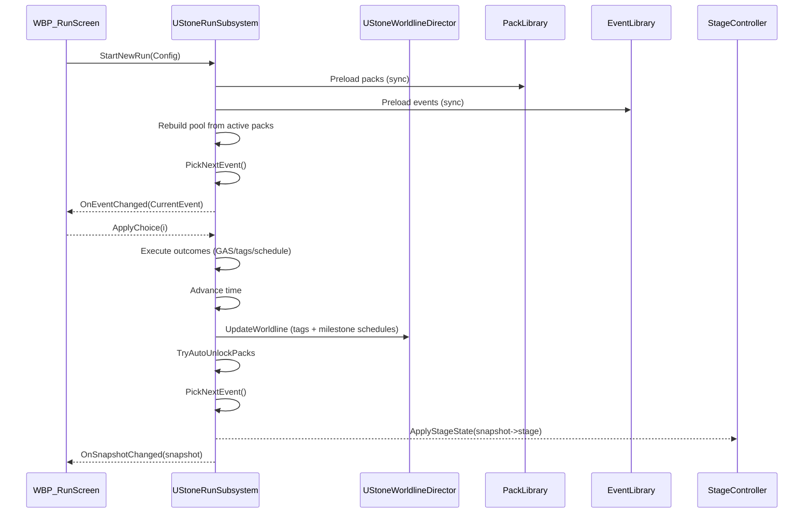
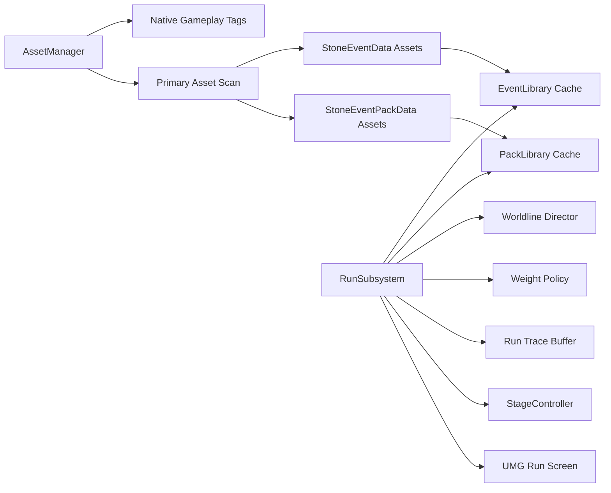
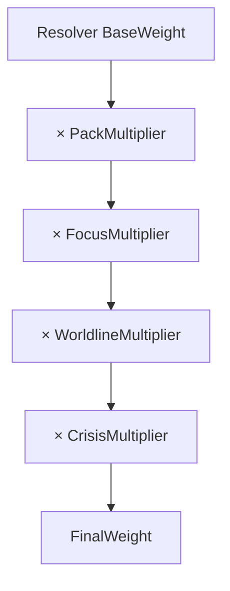

# BoneLaw – Project Bible (Unreal Engine 5.7)
**Genre:** UI‑driven narrative survival strategy (Crusader‑Kings‑style event engine)  
**Core hook:** *Hard choices reshape your people’s “worldline” (culture/values), which unlocks content packs and forces payoffs.*  
**Platform target (demo):** PC (Steam), 10–20 min demo loop, price target €4.99  
**Engine:** Unreal Engine 5.7 (UI‑only, no pawn movement; PlayerController/HUD drive the game)  
**Architecture:** C++ first for critical systems + UMG/Blueprint for presentation

> This document is intended to be a **single source of truth** so a new conversation can start from zero context and still continue implementation correctly.

---

## Table of contents
1. Vision & player experience
2. Demo scope (1‑week plan)
3. High‑level game loop
4. World presentation (“Stage”) concept
5. Data model & tags (native gameplay tags pattern)
6. Content: Events, Choices, Outcomes
7. Packs / Arcs (“StonePacks”)
8. Worldline system (culture drift + milestones)
9. Event selection (resolver + weight policy)
10. Scheduling system (forced/high priority events)
11. Save/Load model (single source of truth)
12. Debugging & validation (trace + content validator)
13. Unreal project setup (template, folders, INI)
14. C++ class list (parents + responsibilities)
15. Blueprint class list (parents + responsibilities)
16. UMG screens & widget contracts
17. StageController & day/night rig
18. Content authoring workflow (how to create new events/packs)
19. Balancing workflow (how to iterate fast)
20. Minimal demo content recipe (what assets to create first)
21. Future roadmap (post‑demo)  
    Appendix A: Diagrams  
    Appendix B: Naming conventions & rules  
    Appendix C: “Do not do this” (anti‑patterns)

---

# 1) Vision & player experience

**BoneLaw** is a **UI‑driven** survival narrative where the player does not directly control characters.  
Instead, the player navigates a sequence of **events**, chooses between 2–4 **choices**, and watches the **stage** (small 3D diorama scene) react: day/night cycles, campfire appearing after discovery, NPC idles changing with morale, etc.

The “Crusader Kings feel” comes from:
- **System consequences** (stats, tags, unlocks) that persist and compound
- **Emergent narrative** created by an event engine + scheduling
- **Worldline drift:** a hidden/visible culture axis system that changes future content availability and weighting
- **Payoffs:** milestones force dramatic events (breakthroughs, taboos broken, raiders) so the run doesn’t feel random

**Tone:** primal, mythic, morally tense.  
**Setting:** early survival “first hearth” era (stone‑age vibe), where decisions form the first laws and taboos of the clan.

---

# 2) Demo scope (1‑week “realistic” target)

**Goal:** a demo that reliably produces a *“one more run”* loop in 10–20 minutes.

### Demo must-have (MVP)
- Run start → event → choices → outcomes → time advances → next event
- Day/Night visual shift (even simple)
- Campfire unlock visual (fire appears after `Unlock.Fire`)
- 20–30 total events (content is *the game*)
- Packs:
    - 1 Starter Pack (10–12 events)
    - 2 Worldline packs (Ruthless vs Merciful) 5–8 events each
- Worldline milestones:
    - 2 forced payoff events guaranteed when drifting strongly

### Demo nice-to-have (only if stable)
- Save/Load
- A debug trace overlay (dev only, but strongly recommended)

### Demo explicitly NOT included
- Open-world movement as gameplay
- Complex crafting/inventory systems
- High-fidelity AI simulation (NPCs are flavor)

---

# 3) High-level game loop

1. **StartNewRun**
    - Initialize GAS/attributes, tags, pack list, preload events
2. **PickNextEvent**
    - Candidate pool from active packs
    - Resolver filters and computes base weight
    - WeightPolicy multiplies weights (pack/focus/worldline/crisis)
    - Scheduler can override with forced events
3. **Present Event**
    - UI shows text and options
4. **ApplyChoice**
    - Check requirements; allow soft-fail choices
    - Execute outcomes (GAS effects, tags, schedule events)
    - Advance time
    - Update worldline (tags/milestones) and auto-unlock packs
    - PickNextEvent again

---

# 4) World presentation (“Stage”) concept

A **small static map/diorama** is always visible behind UI:
- cave/camp area, fire pit, forest edge, water spot
- NPCs idle/walk/gesture as ambient life
- day/night cycle visible via lighting + sky/PP
- the stage is **not** a playable “world”; it is a living UI background

### Why this matters
- Makes a UI-driven game feel like a “real” game
- Streamers can react to visuals even if gameplay is choice-based
- It supports €4.99 credibility better than pure text

---

# 5) Data model & tags (native gameplay tags pattern)

**Rule:** Tags are **native**, registered at startup through a static struct pattern:
- `FStone_GameplayTags` contains `FGameplayTag` fields
- `InitializeNativeGameplayTags()` uses `UGameplayTagsManager::Get().AddNativeGameplayTag(...)`
- No code should call `RequestGameplayTag("…")` at runtime.

### Tag categories (core)
- State: `State.Day`, `State.Night`
- Unlocks: `Unlock.Fire`, `Unlock.Shelter`, `Unlock.Traps`, `Unlock.Herbs`, `Unlock.Cooking`
- Focus: `Focus.Hunt`, `Focus.Shelter`, `Focus.Water`, `Focus.Fire`, `Focus.Forage`
- Event categories: `Event.Hunt`, `Event.Forage`, `Event.Shelter`, `Event.Water`, `Event.Fire`, `Event.Social`, `Event.Illness`, `Event.Injury`
- Timing tags: `Event.Day`, `Event.Night`
- Status: `Status.Bleeding`, `Status.Fever`, etc.

### Worldline tags (drift)
- `Worldline.Merciful` / `Worldline.Ruthless`
- `Worldline.Tradition` / `Worldline.Innovation`
- `Worldline.Xenophile` / `Worldline.Xenophobic`
- `Worldline.TabooLoose` / `Worldline.TabooStrict`
- Milestones:
    - `Worldline.CannibalismUnlocked`
    - `Worldline.RaidersAttracted`
    - `Worldline.HealerPath`
    - `Worldline.ToolmakerPath`

---

# 6) Content: Events, Choices, Outcomes

## 6.1 Event data asset (StoneEventData)
A StoneEvent is authored as a DataAsset:
- **EventId:** must equal AssetName (studio rule)
- **BaseWeight:** baseline selection chance
- **EventTags:** category/timing tags used by resolver + weighting
- **Text:** title/body (and optionally image reference)
- **Choices:** array of 2–4 `FStoneChoiceData`

## 6.2 Choice structure (FStoneChoiceData)
Each choice includes:
- Choice text
- Requirement tags/conditions
- Lock mode:
    - **HardLock:** disabled if not met
    - **SoftFail:** selectable but routes to `FailOutcomes`
- Outcomes:
    - **Outcomes** (success)
    - **FailOutcomes** (soft-fail path)
- Schedules: optional `FStoneScheduledEvent` additions

## 6.3 Outcomes (EStoneOutcomeType)
Outcome types include (examples):
- Modify attributes (via GAS GameplayEffects)
- Add/remove run tags
- Force next event (`ForceNextEvent`)
- Add/remove events from pool (`PoolAddEvent`, `PoolRemoveEvent`)
- Schedule event (`ScheduleEvent`)

### Studio rule for outcomes
- Outcomes should be deterministic and traceable.
- Don’t hide logic in Blueprint graphs that the validator can’t see.

---

# 7) Packs / Arcs (“StonePacks”)

**Problem:** if you throw 500 events into one pool, you lose control.  
**Solution:** packs group events into manageable arcs, and unlock based on tags.

## 7.1 Pack data asset (StoneEventPackData)
Fields:
- **PackId:** must equal AssetName (studio rule)
- DisplayName
- Requirements:
    - RequiredTagsAll
    - BlockedTagsAny
- Auto unlock:
    - `bAutoUnlockWhenRequirementsMet`
    - `bPreloadOnUnlock`
- Phase (starter/mid/late)
- Events list (`FStonePackEntry`):
    - EventId
    - WeightMultiplier (optional)
    - EntryTags (optional)

## 7.2 Unlock flow
- Start with `Config.StartingPackIds` (e.g. `Pack_Starter`)
- Each choice updates tags/culture
- Pack unlock checks run tags and auto-adds new packs
- If `bPreloadOnUnlock`, those events get preloaded

---

# 8) Worldline system (culture drift + milestones)

Worldline is an **axis-based director** that maps culture attributes to:
- stance tags (Merciful/Ruthless, etc.)
- milestone tags (CannibalismUnlocked, etc.)
- forced scheduled payoffs

## 8.1 Axis values
Each axis is a float in range **[-100..+100]**:
- Mercy ↔ Ruthless
- Tradition ↔ Innovation
- Xenophile ↔ Xenophobic
- TabooLoose ↔ TabooStrict
  (Other axes exist but demo can focus on 2–4.)

## 8.2 Attribute mapping (GAS)
Worldline reads culture attributes from GAS via **AttributeRegistry stable names**, e.g.:
- Empathy, Violence
- Innovation, Spirituality
- Xenophobia
- TabooStrictness

Mapping examples:
- Mercy/Ruthless axis ≈ `Violence - Empathy`
- Tradition/Innovation axis ≈ `Innovation - Spirituality`
- Xenophobia axis ≈ `(Xenophobia - 50) * 2`

## 8.3 Milestones & payoffs
When |axis| crosses thresholds:
- **>= 60:** “strong stance” (may set milestone)
- **>= 85:** “extreme stance” triggers forced payoff event

Example forced events (must exist as assets):
- `WL_Cannibal_FirstTime` (forced)
- `WL_Breakthrough_Tools` (forced)
- `WL_Ritual_Healing` (forced)
- `WL_Raiders_Scouts` (high)

---

# 9) Event selection: Resolver + Weight Policy

## 9.1 Resolver (ComputeFinalWeight)
Resolver is responsible for:
- gating events by requirements (tags, time, unlocks)
- computing a base weight
- applying focus mapping (Focus.Hunt => boost Event.Hunt)
- basic day/night gating

Resolver should be **pure**: given (Event, Snapshot) → weight.

## 9.2 Weight policy (WorldlineWeightPolicy)
WeightPolicy multiplies the resolver’s base weight:
- **Worldline multiplier**: align events with stance/milestones
- **Crisis multiplier**: hunger/warmth/health pressure
- Clamped multiplier range: **[0.25..3.0]**

### Combined formula
`FinalWeight = BaseWeight × PackMul × FocusMul × WorldlineMul × CrisisMul`

**PackMul** is taken from `EventWeightMultiplier` map (from packs).  
**FocusMul** can be part of resolver or factored separately.

## 9.3 Fallback rule (no softlocks)
If TotalWeight == 0:
- Prefer Scheduler forced events
- Else pick deterministic random from pool and trace ERROR

---

# 10) Scheduling system (forced/high priority)

The scheduler exists so the game can guarantee dramatic beats.

## 10.1 Scheduled event data
`FStoneScheduledEvent` contains:
- Trigger type:
    - AfterChoices
    - AtDawn
    - AtDusk
    - etc.
- Offset (number of choices/day steps)
- Priority:
    - Forced
    - High
    - Normal
- EventId

## 10.2 Integration
After applying a choice:
- outcomes may schedule events
- Worldline milestones may schedule events
  Before picking the next normal event:
- scheduler can return forced/high events first

---

# 11) Save/Load model (single source of truth)

BoneLaw follows a **single source of truth** approach:
- SaveGame stores all authoritative runtime state:
    - run tags
    - attributes snapshot (or seed + deltas, depending on design)
    - active packs
    - seen event ids
    - pack seen counts
    - scheduler queue
    - RNG seed/state

UI and Stage are derived from snapshot.

---

# 12) Debugging & validation

## 12.1 Run trace buffer (ring buffer)
A lightweight ring buffer logs:
- event candidates + their multipliers
- event pick roll and result
- choice applied (soft fail or success)
- outcomes executed
- scheduled events enqueued
  This is vital for balancing.

## 12.2 Content validator (dev-only, callable from Blueprint)

Validator scans **Primary Assets** (SSOT) via AssetManager when no RootPath is provided.

**What it validates**
- all `StoneEvent` assets under `/Game/Blueprints/Game/Stone/Events`
- all `StonePack` assets under `/Game/Blueprints/Game/Stone/Packs`

**Entry points (C++)**
- `UStoneContentValidator::ValidateAllStoneEvents(RootPath="")`
- `UStoneContentValidator::ValidateAllStonePacks(RootPath="")`
- `UStoneContentValidator::ValidateAllStoneContent(EventsRoot="", PacksRoot="")`

**Recommended dev trigger (no Construct spam)**
- `AStonePlayerController::BeginPlay()` calls `Overlay->BP_RunDevContentValidation()` **once** (non‑shipping builds).
- The overlay widget implements `BP_RunDevContentValidation()` and can:
    - call `ValidateAllStoneContent()` and
    - display issues in a dev panel or just log errors.

This keeps validation **config‑driven** (Project Settings) and prevents accidental multiple runs from widget re-creation.

---

# 13) Unreal project setup

## 13.1 Template

Recommended: **Blank (C++)** (or any template, but we do *not* rely on pawn/camera gameplay).

BoneLaw is **UI‑only**:
- `AStoneGameMode` sets `DefaultPawnClass = nullptr`
- `AStonePlayerController` enforces `InputModeUIOnly` + cursor
- `AStoneHUD` creates the overlay widget and its controller

## 13.2 Folder layout
Canonical content layout (matches demo project):
- `/Game/Blueprints/Game/Stone/Events/`  (StoneEvent primary assets)
- `/Game/Blueprints/Game/Stone/Packs/`   (StonePack primary assets)
- `/Game/Blueprints/Data/Attributes/`    (AttributeRegistry)
- `/Game/Blueprints/Game/Stone/UI/`      (UMG)
- `/Game/Blueprints/Game/Stone/Stage/`   (stage actors / dressing)

## 13.3 Project Settings & INI (keep INI minimal)

Prefer **Project Settings** (editor UI) over hand‑editing INI. INI exists, but we keep it to the smallest stable surface.

### A) AssetManager (required)
Set the AssetManager class:
- **Project Settings → Engine → General Settings → Asset Manager Class**
    - `/Script/BoneLaw.StoneAssetManager`

Primary asset scanning (SSOT for content discovery):
- **Project Settings → Engine → Asset Manager**
    - `StoneEvent` → `/Game/Blueprints/Game/Stone/Events` (Apply Recursively ✅)
    - `StonePack`  → `/Game/Blueprints/Game/Stone/Packs`  (Apply Recursively ✅)

### B) Maps & Modes (UI-only)
- **Project Settings → Maps & Modes**
    - Default GameMode: `/Script/BoneLaw.StoneGameMode`
    - (GameMode sets `DefaultPawnClass = nullptr`)

### C) Stone Content settings (SSOT)
- **Project Settings → Game → Stone Content**
    - `AttributeRegistry` (required)
    - `RequiredWorldlineEventIds`
    - dev toggles for validation / convenience

> Rule: **Do not hardcode content paths in C++**. Content discovery goes through AssetManager primary assets; everything else is a debug override only.

---

# 14) C++ class list (parents + responsibilities)

**Module:** `BoneLaw`  
**Naming:** `Stone*` prefix is the canonical in‑code pattern for the demo.

## 14.1 `UStoneAssetManager` : `UAssetManager`
Early init:
- initializes native GameplayTags (`FStoneGameplayTags::InitializeNativeGameplayTags()`)

## 14.2 `FStoneGameplayTags` (static struct)
Holds all native GameplayTags and provides `Get()` access.

## 14.3 `UStoneContentSettings` : `UDeveloperSettings` (Config=Game)
Project Settings surface (SSOT):
- `AttributeRegistry` (soft reference)
- `RequiredWorldlineEventIds`
- validation/dev toggles

> SSOT rule: **Starting packs are not configured in INI/settings.**
> The caller (UI→PlayerController or GameMode) must provide `FStoneRunConfig.StartingPackIds`.

## 14.4 `UStoneRunSubsystem` : `UGameInstanceSubsystem`
Authoritative run controller:
- start/load run
- holds `FStoneSnapshot`, time state, run tags, focus tag
- applies choices & outcomes
- builds initial event pool from packs (SSOT; no hardcoded EventIds)
- drives event selection + scheduling
- broadcasts `OnSnapshotChanged` / `OnEventChanged`

## 14.5 `AStoneRunAnchor` : `AActor`
Runtime anchor actor that owns/initializes GAS + `UAbilitySystemComponent` for the run.

## 14.6 `UStoneEventLibrary` / `UStonePackLibrary` : `UObject`
Primary-asset caches:
- preload, lookup by `EventId` / `PackId`

## 14.7 `UStoneEventResolver` : `UObject`
Evaluates requirements + resolves choice states and weights.

## 14.8 `UStoneOutcomeExecutor` : `UObject`
Executes outcomes (attribute changes, tag changes, scheduling, pool operations).

## 14.9 `UStoneScheduler` : `UObject`
Queue for scheduled events (forced/high priority) with due checks.

## 14.10 `UStoneWorldlineDirector` / `UStoneWorldlineWeightPolicy` : `UObject`
Worldline system:
- updates worldline state, unlocks, and produces scheduled items
- weight policy multiplies candidate weights (culture drift / crisis)

## 14.11 `UStoneRunTraceBuffer` : `UObject`
Ring buffer for debugging/balancing (events, picks, schedules, outcomes).

## 14.12 `UStoneContentValidator` : `UObject` (static BlueprintCallable)
Dev-only validation of `StoneEvent`/`StonePack` primary assets. Returns `FStoneValidationIssue[]`.

## 14.13 UI pipeline classes
- `AStoneGameMode` : `AGameModeBase` (UI-only, `DefaultPawnClass=nullptr`)
- `AStonePlayerController` : `APlayerController` (UI-only input/cursor; overlay init)
- `AStoneHUD` : `AHUD` (creates overlay + controller)
- `UStoneUserWidget` : `UUserWidget` base with `SetWidgetController()` + `WidgetControllerSet()` hook
- `UStoneWidgetController` : base params container (PC + RunSubsystem)
- `UStoneOverlayWidgetController` : binds to RunSubsystem, broadcasts overlay signals

## 14.14 Stage presentation
- `AStoneStageController` : `AActor` that converts snapshot → `FStoneStageState`, calls `BP_ApplyStageState()`

---

# 15) Blueprint class list

Blueprints are **presentation**. Core authority stays in C++ (SSOT).

## 15.1 `WBP_StoneOverlay` (child of `UStoneUserWidget`)
Main overlay UI (your screenshot layout):
- implements `WidgetControllerSet()` to bind to the widget controller delegates
- implements `BP_RunDevContentValidation()` (dev-only)

## 15.2 `BP_StoneStageController` (child of `AStoneStageController`)
Implements `BP_ApplyStageState(StageState)`:
- day/night visuals
- fire on/off
- cave / scene dressing states

## 15.3 Optional rigs (demo-friendly)
- `BP_StageCameraRig` (AActor): a fixed camera / cinematic camera
- `BP_DayNightRig` (AActor): optional lighting rotation if you want real 3D time-of-day

> No Blueprint GameMode/PlayerController required for v0.0.1alpha: we ship with `AStoneGameMode` + `AStonePlayerController` in C++.

---

# 16) UMG screens & widget contracts

## 16.1 `WBP_StoneOverlay` (main)
Layout (matches target UI):
- **Top:** stage viewport (world view; cave/fire/etc.)
- **Middle-left:** *Event* panel (title/body)
- **Middle-right:** *Choices* panel (2–4 buttons / entries)
- **Bottom:** stats + meta (moral values, unlocks/achievements, run info)

### Contract (SSOT)
Created by `AStoneHUD::InitOverlay()`.

**Controller flow**
1. HUD creates `UStoneOverlayWidgetController`
2. HUD sets params: PlayerController + `UStoneRunSubsystem`
3. HUD creates overlay widget (`OverlayWidgetClass`)
4. Overlay receives controller via `UStoneUserWidget::SetWidgetController()`
5. Overlay implements `WidgetControllerSet()` and binds:
    - `OnOverlaySnapshotChanged`
    - `OnOverlayEventChanged`

**Player actions**
- “Choice clicked” → call `RunSubsystem.ApplyChoice(Index)`
- “Focus changed” → call `RunSubsystem.SetFocus(Tag)` (if you use focus buttons)

## 16.2 Dev trace / validation panels (optional)
- `RunSubsystem.GetTraceBuffer()` can be shown in a ListView for balancing
- Validation issues can be shown when `BP_RunDevContentValidation()` runs (non‑shipping)

---

# 17) StageController & day/night rig

Stage logic is presentation-only:
- **Input:** `FStoneStageState` (derived from snapshot)
- **Output:** lights, PP, NPC visuals

Minimum stage state fields:
- TimeOfDay01, bIsNight
- bFireUnlocked
- Morale / Warmth (optional)

---

# 18) Content authoring workflow

## Create a new StoneEvent
1. Create DataAsset: `StoneEventData`
2. AssetName: `E_Hunt_Rabbit_01` (example)
3. Set `EventId` = same name
4. Set BaseWeight (e.g. 50)
5. Add EventTags (e.g. `Event.Hunt`, `Event.Day`)
6. Add 2–4 choices
7. For each choice:
    - text
    - requirements (optional)
    - outcomes:
        - apply GE to Food/Morale/etc.
        - add tags/unlocks
        - schedule followup events

## Create a pack
1. Create DataAsset: `StoneEventPackData`
2. AssetName: `Pack_Starter`
3. PackId = same
4. Fill event list (EventId entries)
5. Set requirements or leave none for starter

---

# 19) Balancing workflow (fast iteration)

1. Turn on debug trace panel
2. Run demo, pick choices aggressively
3. Watch trace:
    - Candidate weights show Base × Pack × Worldline × Crisis
    - Ensure worldline drift actually changes selection
4. Adjust:
    - BaseWeight per event
    - Pack WeightMultiplier
    - WeightPolicy multipliers (clamp range)
5. Validate content via validator before packaging

---

# 20) Minimal demo content recipe (first implementation)

## Required worldline events (create these assets)
- `WL_Cannibal_FirstTime`
- `WL_Breakthrough_Tools`
- `WL_Ritual_Healing`
- `WL_Raiders_Scouts`

## Starter pack
`Pack_Starter` includes 10–12 events:
- 2 Hunt
- 2 Forage
- 2 Shelter
- 2 Water
- 1 Fire discovery
- 1 Social conflict

## Worldline packs
- `Pack_WL_Ruthless` (Required: Worldline.Ruthless)
- `Pack_WL_Merciful` (Required: Worldline.Merciful)

Each includes 5–8 events:
- Ruthless: punishment, raiding, taboo breaks, coercion
- Merciful: healing, sharing, adoption, truce

---

# 21) Future roadmap (post-demo)

- Expand axes (Collective/Individual, Spiritual/Practical)
- More packs (mid/late game arcs)
- Meta-progression (unlock event sets between runs)
- Steam achievements (worldline milestone tags map well)
- Better stage reactivity (more NPC states, props unlocking)
- Localization pipeline (DataAssets to loc table)

---

# Appendix A) Diagrams

## A1) Runtime flow (sequence)

## A2) Data & cache overview

## A3) Weight composition

---

# Appendix B) Naming conventions & rules

1. **AssetName == Id**
    - StoneEvent asset name must equal `EventId`
    - StonePack asset name must equal `PackId`
2. IDs should be stable and descriptive:
    - `E_Hunt_Rabbit_01`, `E_Shelter_Storm_01`
    - `WL_Cannibal_FirstTime`
3. Pack naming:
    - `Pack_Starter`
    - `Pack_WL_Ruthless`, `Pack_WL_Merciful`
4. No runtime `RequestGameplayTag` usage.

---

# Appendix C) Anti-patterns (do not do this)

- Don’t hide core logic in random Blueprint graphs (validator can’t see it).
- Don’t load assets in the pick hot path (no `TryLoad()` while picking).
- Don’t build one giant event pool with no packs.
- Don’t add 100 skills/attributes in demo. Keep culture axes few and meaningful.
- Don’t expand to open-world gameplay before the event engine is fun.

---

## Notes about expired uploaded files
Some previously uploaded reference files (e.g., `Uhu_AssetManager.*`, `Uhu_GameplayTags.*`) are no longer available in this environment.  
This document is based on the full conversation content and the class designs written in-chat. If you want **patch-exact** integration against an existing codebase, re-upload the current project files and we’ll generate exact diffs.
